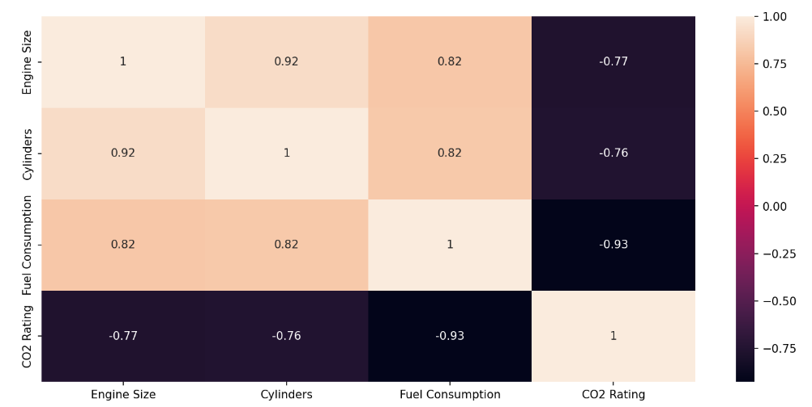
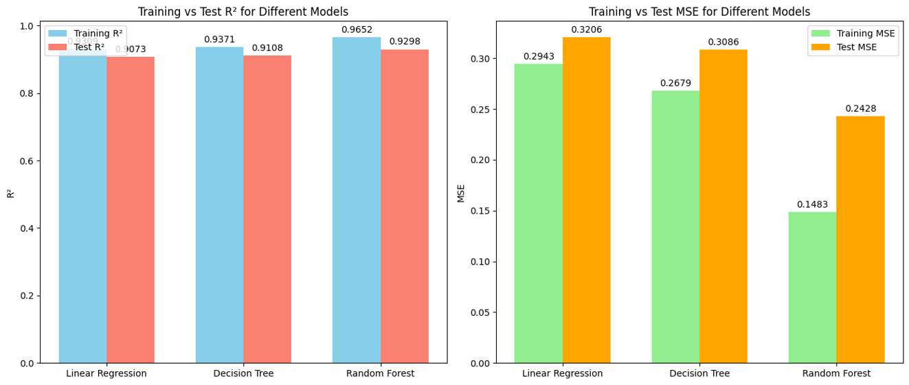
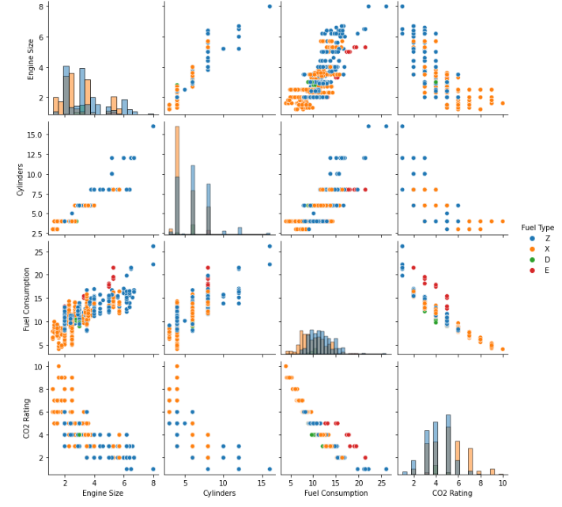

 
 <h2 align="center">Project Overview</h2>

### Hi there 👋 I'm Shantanu Shinde  
> Cyber Security Enthusiast and Machine Learning Developer

 

I am a BTech 3rd-year student, actively seeking opportunities in Cyber Security and Machine Learning projects. With a keen interest in exploring and learning, I am passionate about building skills and working on challenging projects that allow me to grow and contribute meaningfully to the tech community.

### Project Description 🚗

This project focuses on **Fuel Consumption Prediction** using Machine Learning. The model predicts a vehicle's fuel efficiency (in L/100 km on highways) based on key parameters:

- **Vehicle Class**
- **Engine Size (L)**
- **Cylinders**
- **Transmission**
- **Fuel Consumption (Hwy L/100 km)** 
- **Fuel Type** 

The project is built using Python and leverages the following libraries and tools:

- **scikit-learn**: Model training and evaluation
- **pandas**: Data manipulation
- **numpy**: Numerical operations
- **matplotlib**: Data visualization
- **streamlit**: Interactive web application for real-time predictions

### Machine Learning Algorithms Used 🧠

- **Linear Regression**
- **Decision Tree**
- **Random Forest**

### Programming Languages 🌐

|  |  |  |   |  |
|---|---|---|---|---|

### Tools 🛠️

|  |  |  |  |
|---|---|---|---|

### Outputs 📊

Below are some outputs and visualizations from the project:

#### 1. Confusion Matrix 

#### 2. Result of All 3 Models Prediction

#### 3. R2 Score and MSE Results

#### 4. Comparison of All Features with Fuel Type

#### 5. Streamlit App Interface 

### 🤝🏻 Connect with Me

